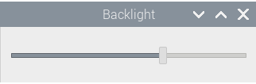

# backlight-gui

"backlight-gui" is a tiny GUI utility to control the display brightness via ``/sys/class/backlight/``.



## Installation

You can download the software packages arranged for installing on Raspberry Pi OS from the [Releases](https://github.com/esrille/backlight-gui/releases) page.

Note: This software is currently tested on Esrille [Unbrick](https://www.esrille.com/unbrick.html) series.

### Building Sources

To build and install "backlight-gui" manually, run the following commands:

```
git clone https://github.com/esrille/backlight-gui.git
./autogen.sh
make
sudo make install
```

## Resources

- [Contributing](https://github.com/esrille/backlight-gui/blob/main/CONTRIBUTING.md)
